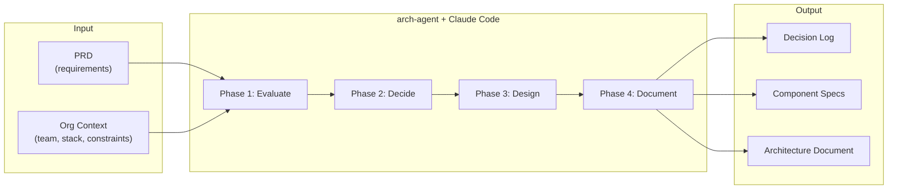
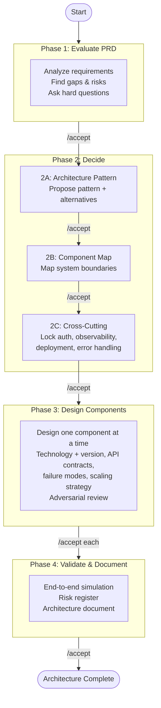
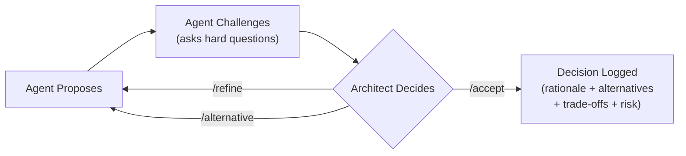

# arch-agent

[](https://www.npmjs.com/package/arch-agent)
[](LICENSE)
[]()

**Structured architecture design for AI-assisted development.**

arch-agent turns [Claude Code](https://docs.anthropic.com/en/docs/claude-code) into an opinionated architecture reviewer that guides your team through a rigorous, phase-gated design process. It challenges assumptions, enforces decision gates, and produces a documented architecture — not just a generated wall of text.

## The Problem

Architecture decisions are the most expensive to reverse. Yet most teams either:

- **Skip formal design** and pay for it later in rework
- **Generate AI docs** that say "yes" to everything and reflect no real constraints
- **Write documents once** that become outdated and disconnected from reality

arch-agent solves this by combining AI reasoning with human-controlled gates. The AI proposes and challenges. You decide. Every decision is logged with rationale, alternatives, and trade-offs.

## What Goes In, What Comes Out



**Input:** Your PRD and organizational context (team size, tech stack, constraints).

**Output:** A decision log, detailed component specs, and a comprehensive architecture document — every choice backed by rationale and alternatives.

## How the Process Works

arch-agent enforces a four-phase workflow. Each phase has a gate — you must explicitly `/accept` before proceeding. The agent cannot skip phases or auto-accept. This is enforced by Python validation hooks at the file system level, not by prompt instructions.



At every gate, you can:
- `/accept` — Confirm the proposal and advance
- `/refine [feedback]` — Request specific changes
- `/alternative [request]` — Request a different approach

## Example: What the Output Looks Like

**Decision log entry:**
```
### [DEC-003] Phase 2A | Architecture Pattern
- Decision: Modular monolith with event-driven boundaries
- Rationale: 6-person team, single deployment unit reduces operational burden
- Alternatives: Microservices (rejected: team too small), Serverless (rejected: cold start latency)
- Trade-offs: Sacrifices independent deployment for operational simplicity
- Risk: Module boundaries may need extraction to services at 10x scale
```

**Component design (abbreviated):**
```
## Auth Service — Component Design

Technology: Keycloak 24.0 (self-hosted) + PostgreSQL 16
Pattern: OAuth 2.0 + OIDC, RS256 JWT tokens

Integration Points:
  IN:  POST /auth/token  <- API Gateway (client credentials)
  IN:  POST /auth/login  <- Web Client (authorization code flow)
  OUT: JWT validation    -> All services (public key endpoint)

Failure Modes:
  - Keycloak down -> Circuit breaker, return cached JWKS for 15min
  - Database failover -> Read replica promotion, ~30s token delay
  - Token leak -> Revocation endpoint + short-lived tokens (5min)

Cross-Cutting Compliance:
  Auth: RS256 JWT per Phase 2C decision DEC-007
  Observability: Structured JSON logs, login attempt metrics
  Deployment: Helm chart, horizontal pod autoscaler
```

## Who Is This For

- **Tech leads** starting a new project who want structured design, not a blank whiteboard
- **Architects** who want AI assistance with human control over every decision
- **Teams** that need documented architecture decisions for compliance, onboarding, or audit
- **Solo developers** building complex systems who want an adversarial reviewer to catch blind spots

## Quick Start

### New project

```bash
npx arch-agent init --name "My Project"
```

Then:
1. Write your requirements in `.arch/prd.md`
2. Optionally describe your team and constraints in `.arch/org-context.md`
3. Start Claude Code and type `/analyze-prd`

The agent walks you through all four phases. At each gate, review the proposal and `/accept`, `/refine`, or `/alternative`.

### Existing architecture

```bash
npx arch-agent import existing-architecture.md --name "My Project"
```

The agent parses your document and walks through each phase, challenging your existing decisions. Accept what's solid, refine what's outdated. Imported projects get 5 reopens (vs 2) for more iteration room.

**Requirements:** Node.js 18+, [Claude Code](https://docs.anthropic.com/en/docs/claude-code), Python 3, git

## Commands

### Workflow commands

| Command | Description |
|---------|-------------|
| `/analyze-prd` | Evaluate PRD, find gaps, assess risks |
| `/propose-methodology` | Architecture pattern, component map, cross-cutting decisions |
| `/design-component [name]` | Detailed design for one component |
| `/generate-docs` | Validate and generate final architecture document |
| `/import-architecture` | Import and review an existing architecture document |

### Decision commands

| Command | Description |
|---------|-------------|
| `/accept` | Accept current proposal and advance |
| `/refine [feedback]` | Request specific changes |
| `/alternative [request]` | Request a different approach |
| `/reopen [target] [reason]` | Reopen an accepted decision (max 2 per project) |

### Utility commands

| Command | Description |
|---------|-------------|
| `/review-component [name]` | Launch adversarial review of a component |
| `/status` | Show current progress |
| `/decision-log` | Show all recorded decisions |
| `/help` | Show available commands for current phase |

## Decision Governance

Every architectural decision flows through a controlled lifecycle:



Decisions are **immutable once accepted** — unless you spend one of your limited reopens (max 2 per project). Reopening cascades: changing an early decision un-accepts everything downstream.

This prevents both design thrashing and premature lock-in.

## Key Design Decisions

**Hard enforcement, not prompt instructions.** Python validation hooks block illegal state transitions at the file system level. Phase skipping, backward transitions, and component injection are blocked regardless of what the AI is asked to do.

**Cross-cutting decisions before component design.** Auth, observability, deployment, and error handling strategies are locked in Phase 2C. Every component in Phase 3 must comply with these constraints. This prevents inconsistency across components.

**One component at a time.** Phase 3 designs components sequentially in dependency order. Each component is reviewed against previously accepted components for integration consistency. No parallel design that leads to interface mismatches.

**Controlled iteration.** The `/reopen` command allows going back to fix decisions with cascading invalidation. Reopening Phase 2A un-accepts 2B, 2C, and marks all components as "needs-review". Limited to 2 reopens per project to prevent design thrashing.

## Example Scenario

A team of 8 engineers is building a payment platform. Here's how arch-agent guides the process:

```
$ npx arch-agent init --name "Payment Platform"
# Add PRD to .arch/prd.md, then start Claude Code

/analyze-prd
  -> Agent finds 3 critical gaps: no PCI-DSS mention, missing DR strategy,
     undefined latency SLA. Team answers questions, refines, accepts.

/propose-methodology
  -> Agent proposes modular monolith (team too small for microservices).
     Compares against 2 alternatives. Team accepts.

  -> Agent maps 7 components: API Gateway, Payment Engine, Card Vault,
     Notification Service, Admin Dashboard, Audit Service, Compliance Reporter.

  -> Agent locks cross-cutting: mTLS for internal auth, structured JSON logging,
     Kubernetes deployment, circuit breakers on external calls, PCI-compliant
     data isolation for Card Vault.

/design-component api-gateway
  -> Kong Gateway 3.x, rate limiting, JWT validation, failure modes documented.
  -> Team accepts. Agent advances to next component.
  [... continues through all 7 components ...]

/generate-docs
  -> Agent validates end-to-end, builds risk register, generates architecture doc.
```

Result: A complete architecture document with 20+ logged decisions, each with rationale and alternatives.

## Project Structure

```
your-project/
├── CLAUDE.md                         # Agent identity and phase rules
├── .arch/
│   ├── state.json                    # Phase state machine
│   ├── prd.md                        # Your requirements (you edit this)
│   ├── org-context.md                # Team, stack, constraints (you edit this)
│   ├── decisions.md                  # Auto-generated decision log
│   ├── scripts/
│   │   ├── validate-transition.py    # Enforcement hook
│   │   └── log-decision.py           # Auto-logging hook
│   ├── components/                   # Component design outputs
│   └── reviews/                      # Adversarial review findings
├── .claude/
│   ├── settings.json                 # Hook configuration
│   ├── commands/                     # Slash commands
│   └── skills/                       # Auto-activating skills
└── output/
    └── architecture-document.md      # Final deliverable
```

## CLI Reference

```bash
npx arch-agent init [--name <name>] [--force]     # Scaffold a new project
npx arch-agent import <source> [--name <name>]     # Import existing architecture
npx arch-agent verify                               # Check prerequisites
npx arch-agent reset [--yes]                        # Reset state to initial
```

## Documentation

- [User Guide](docs/USER-GUIDE.md) — Step-by-step walkthrough
- [Architecture](docs/ARCHITECTURE.md) — System design and enforcement layers
- [Methodology](docs/METHODOLOGY.md) — Four-phase design methodology
- [Contributing](docs/CONTRIBUTING.md) — How to contribute
- [Changelog](CHANGELOG.md) — Version history

## License

MIT
