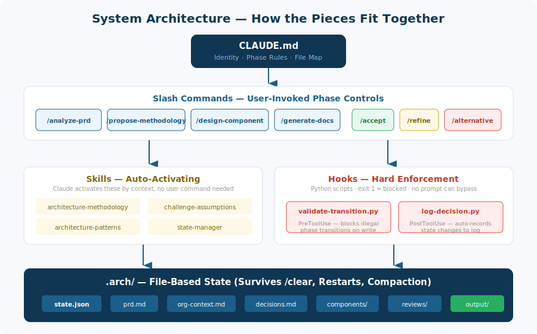
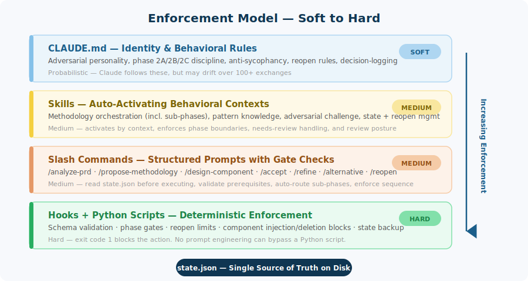
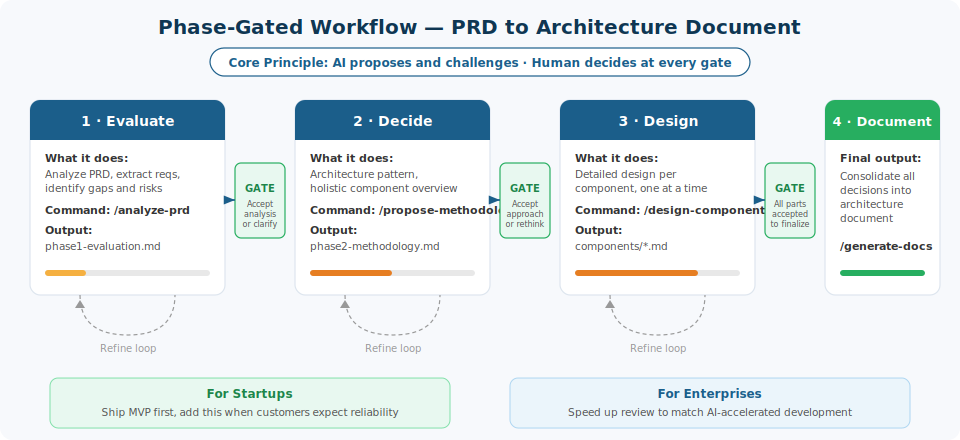
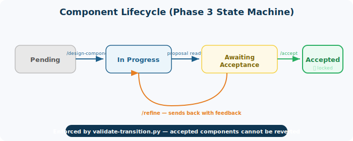

# Architecture Design — Architecture Agent for Claude Code

## Overview

The Architecture Agent is a **file-based, phase-gated workflow toolkit** that turns Claude Code into a rigorous solution architecture assistant. It is not a chatbot with architectural knowledge — it is a structured review process encoded into Claude Code's native primitives: CLAUDE.md memory, slash commands, auto-activating skills, hooks, and Python validation scripts.

The system enforces a four-phase methodology that takes a Product Requirements Document (PRD) as input and produces a comprehensive architecture document as output. At every decision point, the AI proposes and challenges while the human maintains decision authority.

## System Architecture



The system is composed of five distinct layers, each with a different enforcement strength. This layered approach is deliberate — it addresses a fundamental problem with LLM-based tools: behavioral drift over long conversations.

### Layer 1: CLAUDE.md (Soft Enforcement)

CLAUDE.md is the persistent behavior file that Claude Code loads at the start of every session. It defines:

- **Identity**: The agent's adversarial reviewer personality — it challenges assumptions rather than agreeing.
- **Phase Rules**: The four-phase sequence with Phase 2 sub-phases (2A/2B/2C) and what is/isn't allowed in each phase.
- **Decision Logging Format**: A structured template for recording every architectural decision with rationale, alternatives, and trade-offs.
- **Reopen Rules**: Controlled backward transitions with cascading effects and limits.
- **File Map**: References to all state files, outputs, and working directories.

**Enforcement strength**: Soft. Claude follows these instructions probabilistically. Over long conversations (100+ exchanges), it may drift from the adversarial posture or begin skipping phase checks. This is a known limitation of instruction-following in LLMs.

### Layer 2: Skills (Medium Enforcement)

Four auto-activating skills provide context-specific behavioral rules:

| Skill | Purpose |
|-------|---------|
| **architecture-methodology** | Orchestration: enforces phase sequence including 2A/2B/2C sub-phases, blocks out-of-phase discussions |
| **architecture-patterns** | Knowledge: pattern selection criteria based on team size, operational reality, and requirement signals |
| **challenge-assumptions** | Personality: adversarial review rules — forces Claude to push back on proposals, flag anti-patterns, probe failure modes |
| **state-manager** | Task: state.json read/write logic, valid transitions, component tracking, reopen operations, `needs-review` status handling |

**Enforcement strength**: Medium. Skills activate by context rather than explicit command, providing behavioral nudges that reinforce the process. They strengthen CLAUDE.md's soft rules but are still probabilistic.

### Layer 3: Slash Commands (Medium Enforcement)

Fourteen user-invoked commands provide structured entry points to each phase:

**Phase commands**: `/analyze-prd`, `/propose-methodology`, `/design-component`, `/generate-docs`

**Decision commands**: `/accept`, `/refine`, `/alternative`, `/reopen`

**Utility commands**: `/status`, `/decision-log`, `/review-component`, `/help`

Each command reads `state.json` before executing and validates prerequisites. For example, `/propose-methodology` checks that Phase 1 is accepted, then auto-routes to the correct sub-phase (2A, 2B, or 2C) based on current acceptance state.

**Enforcement strength**: Medium. Commands are structured prompts with embedded state checks. They are more reliable than bare conversation because they include explicit instructions, but they still rely on Claude interpreting and following those instructions.

### Layer 4: Hooks + Python Scripts (Hard Enforcement)

Two Python scripts provide deterministic enforcement that cannot be bypassed by any prompt:

**validate-transition.py** (PreToolUse hook)
- Runs before every write to `state.json`
- Validates JSON schema (required keys and phases) on every write, including first write
- Validates phase transitions against a legal transition map
- Checks prerequisites (e.g., Phase 1 must be accepted before Phase 2; all of 2A, 2B, 2C must be accepted before Phase 3)
- Ensures only one component is active at a time
- Prevents reverting accepted components
- Blocks new components injected with non-`pending` status
- Blocks deletion of accepted components
- Enforces forward-only transitions unless a reopen is in progress (reopen count must increment)
- Enforces maximum reopen limit (default: 2 per project)
- Backs up `state.json` before allowing mutations
- Blocks empty stdin (prevents accidental state wipe)
- **Exit code 1 blocks the write** — Claude receives an error message explaining why

**log-decision.py** (PostToolUse hook)
- Runs after every write to `.arch/*.md` or `state.json`
- Auto-records state changes to the decision log

**Enforcement strength**: Hard. A Python script that exits with code 1 is deterministic. No prompt engineering, no matter how creative, can bypass it. This is the safety net for all the soft/medium layers above.

### Layer 5: File-Based State (.arch/)

All state lives on disk in the `.arch/` directory:

| File | Purpose |
|------|---------|
| `state.json` | Phase state machine — single source of truth |
| `prd.md` | The input PRD document |
| `org-context.md` | Organizational constraints, team profile, tech stack |
| `decisions.md` | Running decision log with timestamps |
| `phase1-evaluation.md` | Phase 1 output |
| `phase2-methodology.md` | Phase 2A architecture pattern |
| `phase2-components-overview.md` | Phase 2B holistic component map |
| `phase2-cross-cutting.md` | Phase 2C cross-cutting decisions |
| `components/*.md` | One detailed design file per component (Phase 3 output) |
| `reviews/*.md` | Adversarial review findings |

**Why files, not conversation memory?** Files survive `/clear`, session restarts, context window compaction, and even switching machines. Conversation tokens are ephemeral — they disappear when the context window fills up. For a process that may span hours or days, file-based state is the only reliable approach.

## Enforcement Model



The layered enforcement model addresses a fundamental challenge: LLM behavior is probabilistic, but architecture review requires deterministic gates. The solution is defense in depth:

1. **CLAUDE.md** provides the behavioral baseline (soft)
2. **Skills** reinforce phase-appropriate behavior (medium)
3. **Commands** add structured entry points with validation (medium)
4. **Hooks** provide hard gates that cannot be circumvented (hard)
5. **File state** ensures persistence regardless of session lifecycle

If the soft layers drift (which they will over long conversations), the hard layers catch the violation.

## Phase Workflow



### Phase Sequence

Each phase must complete and be explicitly accepted before the next phase begins:

1. **Evaluate** (Phase 1): Analyze the PRD — extract requirements, identify gaps, assess risks. Includes optional discovery interview if org-context is empty.
2. **Decide** (Phase 2): Three sub-phases, each independently accepted:
   - **2A — Pattern**: Choose architecture pattern with rationale and trade-offs
   - **2B — Components**: Map all system components and their relationships
   - **2C — Cross-Cutting**: Lock auth, observability, deployment, error handling, and data management strategies
3. **Design** (Phase 3): Detail each component one at a time — technology choices, integration points, failure modes. Each component must comply with Phase 2C constraints.
4. **Document** (Phase 4): Validate end-to-end consistency, build risk register, then consolidate everything into a comprehensive architecture document.

### Gate Rules

- Phase 1 → Phase 2: PRD analysis must be explicitly accepted
- Phase 2A → Phase 2B: Architecture pattern must be accepted
- Phase 2B → Phase 2C: Component overview must be accepted
- Phase 2C → Phase 3: Cross-cutting decisions must be accepted (all of 2A + 2B + 2C)
- Phase 3 → Phase 4: ALL individual components must be accepted
- Phase 4 → Complete: Final document must be approved

These gates are enforced at three levels: commands check state before executing, the adversarial personality challenges acceptance, and the Python validator blocks illegal transitions.

### Backward Transitions (Reopen)

By default, phase transitions are **forward-only**. The `/reopen` command provides a controlled escape hatch:

- Maximum 2 reopens per project (enforced by Python validator)
- Reopening a phase cascades: downstream phases are un-accepted, Phase 3 components become `needs-review`
- Every reopen requires written justification, logged as a decision
- The Python validator allows backward transitions only when `reopens.count` increments

This prevents design thrashing while acknowledging that architecture is iterative.

### Refinement Loops

At every phase, the user can:
- **Accept** (`/accept`): Confirm the current proposal and advance
- **Refine** (`/refine`): Request specific changes while staying in the current phase
- **Alternative** (`/alternative`): Request a completely different approach

Refinement loops are unlimited — the user can iterate as many times as needed before accepting.

## Component Lifecycle



During Phase 3, each component follows a strict state machine:

```
pending → in_progress → awaiting_acceptance → accepted (locked)
                ↑              ↓                  │
                └── /refine ───┘                  │
                ↑                                 │
                └──── needs-review ←── /reopen ───┘
```

Key constraints enforced by validate-transition.py:
- Only one component can be `in_progress` or `awaiting_acceptance` at a time
- Accepted components cannot be reverted (except via `/reopen`, which sets them to `needs-review`)
- Components cannot skip states (e.g., `pending` → `accepted`)
- New components must enter as `pending` (cannot be injected as `accepted`)
- Accepted components cannot be deleted
- `needs-review` components must go through `in_progress` before re-acceptance (cannot jump directly to `accepted`)

## State Schema

The `state.json` file tracks the complete project state:

```json
{
  "project_name": "...",
  "current_phase": "not_started | evaluation | methodology | components | finalization",
  "phases": {
    "evaluation": {
      "status": "...",
      "accepted": false,
      "org_context_source": "file | interview | assumed | null"
    },
    "methodology": {
      "sub_phase": "pattern | components_overview | cross_cutting | null",
      "pattern_accepted": false,
      "components_overview_accepted": false,
      "cross_cutting_accepted": false,
      "cross_cutting_decisions": {},
      "accepted": false
    },
    "components": {
      "components": { "name": { "status": "pending | in_progress | awaiting_acceptance | accepted | needs-review" } },
      "accepted_count": 0,
      "total_count": 0,
      "all_accepted": false
    },
    "finalization": {
      "validation_complete": false,
      "document_generated": false,
      "document_approved": false
    }
  },
  "reopens": { "count": 0, "max": 2, "history": [] },
  "decision_count": 0
}
```

## Design Decisions

### Why adversarial, not collaborative?

A reviewer that agrees with everything catches nothing. The challenge-assumptions skill ensures every component gets probed for failure modes, operational burden, and premature technology choices. If every proposal is accepted on the first pass, the process isn't providing value.

### Why validate methodology before building a product?

The original requirements document described a full web application (React frontend, FastAPI backend, PostgreSQL database, WebSocket streaming). Through the design process itself, we discovered that the methodology is the value — not the platform. A 25-file toolkit validated on real engagements delivers more value than months of SaaS development with an unproven process.

### Why one component at a time?

Each component's integration points, technology choices, and failure modes affect subsequent components. Parallel design leads to integration conflicts discovered too late. Sequential design with explicit acceptance ensures each component's decisions are locked before downstream components are designed.

### Why explicit acceptance (not "looks good")?

"Looks good" and "that's fine" are passive agreement. The system requires explicit `/accept` and the adversarial personality raises concerns before processing acceptance. This forces the architect to consciously commit to each decision, which improves decision quality and produces a clearer decision log.

### Why Phase 2C before Phase 3?

Cross-cutting concerns (auth, observability, deployment, error handling) affect every component. Without pre-agreed strategies, each component designer makes different choices — JWT vs session cookies, structured vs unstructured logs, different retry policies. Phase 2C establishes these constraints upfront so Phase 3 designs are consistent by default.

### Why limited reopens?

Unlimited backward transitions lead to design thrashing — endlessly revisiting decisions without converging. Two reopens per project strikes a balance: enough flexibility to fix genuine mistakes, but not enough to avoid commitment. The cascading effects (downstream un-acceptance) make the cost of reopening visible, encouraging thoughtful use.

## Security Considerations

### File Permissions

- `CLAUDE.md` and `.claude/*` are in the `deny` list — Claude cannot modify its own instructions
- Hook scripts run as the current user — they inherit the user's filesystem permissions
- `state.json` writes are validated by the hook before being persisted
- State backup (`state.json.bak`) is created before every validated mutation

### API Key Handling

The Architecture Agent does not handle API keys directly. Claude Code manages its own API credentials. No credentials are stored in the `.arch/` directory.

### Manual Override Risk

If a user manually edits `state.json`, they bypass the hook validation. This is documented as an explicit "don't do this" in the README. The hooks protect against Claude attempting illegal transitions, not against users editing files directly.

## Limitations

- **Model quality matters**: Architecture advice quality depends heavily on the Claude model. Opus handles complex trade-offs significantly better than Haiku.
- **Long conversation drift**: Over 100+ exchanges, Claude may become more agreeable. Mitigation: use `/clear` to reset context while preserving file state.
- **Accept detection**: Relies on Claude interpreting the `/accept` command correctly, not a button click. The challenge-assumptions skill adds friction to reduce accidental acceptance.
- **Single-user**: The current design assumes one architect per project. Collaborative workflows require manual coordination (share files, collect feedback offline, resume).
- **Reopen limit**: Two reopens per project is a hard limit. For highly exploratory projects, this may be insufficient — but the constraint is intentional to prevent design thrashing.
