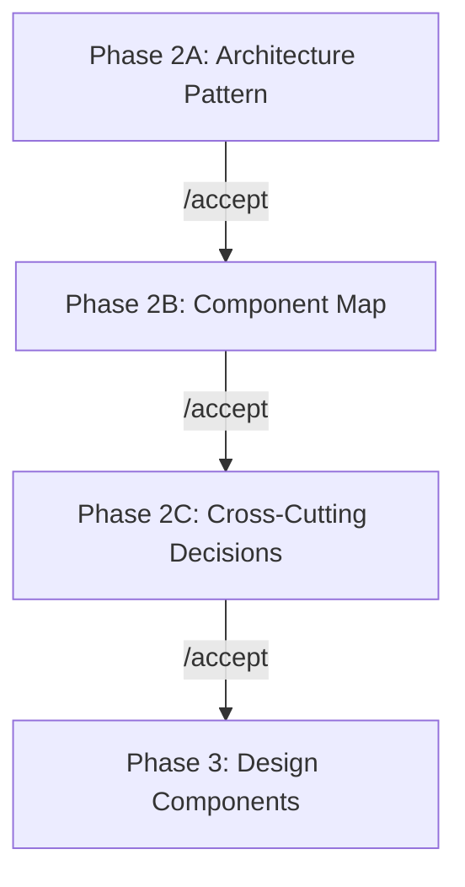
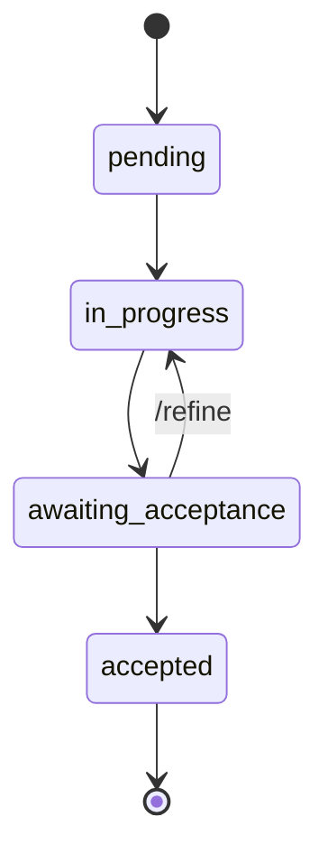
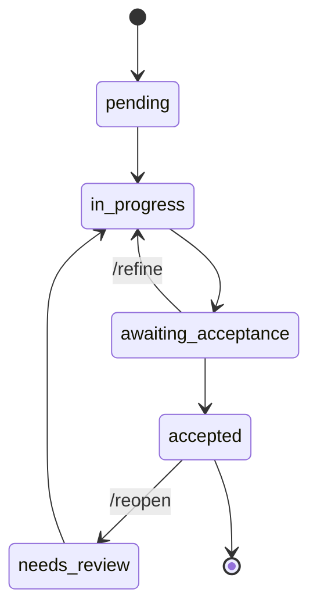

# Methodology — The Four-Phase Architecture Review

## The Problem This Solves

AI-assisted development tools enable developers to produce working code at unprecedented speed. But working code is not the same as production-ready architecture. The gap between "it runs" and "it runs reliably at scale" is where architecture discipline lives.

Traditional architecture review — TOGAF, review boards, enterprise tools — was designed for a slower pace. When development takes weeks, a two-week review cycle is proportional. When AI generates a working system in hours, the same review cycle becomes a bottleneck that teams bypass under pressure.

The Architecture Agent provides a middle path: structured review that matches AI-accelerated development speed, without sacrificing the rigor that production systems demand.

## Core Principle

> **AI proposes and challenges. Human decides at every gate.**

The AI never auto-accepts. The AI never skips a phase. The AI actively challenges proposals and flags risks. But every decision — from architecture pattern selection to individual technology choices — requires explicit human acceptance.

## Phase 1: Evaluate

**Command**: `/analyze-prd`

**Purpose**: Understand what we're building before deciding how to build it.

**Input**: PRD document (`.arch/prd.md`) + organizational context (`.arch/org-context.md`)

### Discovery Interview

If `.arch/org-context.md` is empty or contains only template placeholders, the agent offers to interview you before evaluating the PRD. The interview covers three blocks:

| Block | Focus | Questions |
|-------|-------|-----------|
| Scale & Complexity | Expected users, data volume, geographic distribution, integration count, real-time requirements | 5 |
| Team Reality | Team size, experience level, on-call capacity, deployment frequency, existing infrastructure | 5 |
| Constraints | Budget, timeline, compliance/regulatory, vendor lock-in tolerance, technology mandates | 5 |

After the interview, the agent derives a **complexity tier** (Startup / Growth / Enterprise / Specialized) that calibrates all subsequent recommendations. A 3-person startup gets different advice than a 200-person enterprise team.

If you skip the interview, the agent documents explicit assumptions marked `[ASSUMED CONTEXT]` so they can be challenged later.

### What the agent does
- Extracts functional requirements with IDs (FR-001, FR-002...)
- Identifies non-functional requirements or flags them as missing
- Finds gaps rated by severity (Critical / Important / Minor)
- Asks specific, pointed questions — not vague asks
- Assesses risks across integration, scalability, security, operations, and team capability
- Rates overall PRD quality

### What the architect does
- Answers gap questions with concrete details
- Challenges the analysis if something was missed
- Adds context the PRD doesn't capture (legacy systems, regulatory, team history)
- Iterates with `/refine` until satisfied
- Explicitly accepts with `/accept`

**Gate**: PRD analysis accepted → proceed to Phase 2

**Anti-patterns caught here**:
- Vague requirements ("high availability" without a number)
- Missing non-functional requirements (no mention of monitoring, DR, security)
- Implicit assumptions the PRD doesn't state

## Phase 2: Decide (Three Sub-Phases)

Phase 2 is split into three independently-accepted sub-phases. Each builds on the previous one and must be accepted before the next begins.



**Command**: `/propose-methodology` (auto-routes to the correct sub-phase)

### Phase 2A: Architecture Pattern

**Purpose**: Choose the right architecture pattern before mapping components.

**What the agent does**:
- Proposes an architecture pattern (microservices, modular monolith, serverless, event-driven, hybrid) with rationale tied to specific requirements and team constraints
- Presents trade-offs honestly — what this approach sacrifices
- Compares at least 2 alternatives with pros/cons
- Factors in team skills from `.arch/org-context.md`
- Considers operational burden, not just development convenience

**What the architect does**:
- Evaluates whether the pattern fits the team's operational reality (not just technical elegance)
- Requests alternatives with `/alternative` if the approach doesn't feel right
- Iterates with `/refine` until confident
- Accepts with `/accept`

**Gate**: Pattern accepted → proceed to Phase 2B

### Phase 2B: Component Map

**Purpose**: Map the complete system before designing individual parts.

**What the agent does**:
- Provides a holistic component overview: complete list of all system components, their roles, how they integrate, and high-level technology suggestions
- Shows component dependency map
- Identifies integration points between components

**What the architect does**:
- Reviews the component map for completeness — are all integrations covered? Any missing components?
- Validates that the component breakdown aligns with the accepted pattern
- Iterates with `/refine` or requests `/alternative`
- Accepts with `/accept`

**Gate**: Component overview accepted → proceed to Phase 2C

**Why holistic before detailed**: You cannot evaluate a component without understanding where it fits in the system. The holistic overview ensures everyone sees the same big picture before drilling down. This prevents the common failure mode where individually-designed components don't integrate cleanly.

### Phase 2C: Cross-Cutting Decisions

**Purpose**: Lock system-wide architectural decisions BEFORE designing individual components.

This is the critical sub-phase that prevents inconsistency in Phase 3. Cross-cutting decisions are constraints that every component must comply with.

**What the agent proposes (5 decision areas)**:

| Area | Decisions |
|------|-----------|
| **Authentication & Authorization** | Auth strategy, identity provider, token format, RBAC/ABAC model, session management |
| **Observability** | Logging format, metrics collection, tracing approach, alerting strategy, dashboard tooling |
| **Deployment** | Container strategy, orchestration, CI/CD pipeline, environment promotion, rollback approach |
| **Error Handling** | Error classification, retry policies, circuit breaker patterns, graceful degradation, user-facing error format |
| **Data Management** | Data ownership per component, consistency model (eventual vs strong), backup/recovery, migration strategy |

**What the architect does**:
- Reviews each cross-cutting decision for consistency and feasibility
- Validates that the team can actually operate these choices
- Ensures compliance requirements are addressed
- Iterates with `/refine` until all 5 areas are solid
- Accepts with `/accept`

**Gate**: All three sub-phases (2A + 2B + 2C) accepted → proceed to Phase 3

**Why cross-cutting before components**: Without pre-agreed auth, observability, and error handling strategies, each component designer makes different choices. Component A uses JWT while Component B uses session cookies. Component C logs as JSON while Component D logs as plain text. Phase 2C prevents this by establishing constraints upfront.

### Anti-patterns caught in Phase 2
- Resume-Driven Development (choosing Kubernetes for a 3-person team)
- Cargo Cult Architecture (microservices because Netflix does it)
- Missing integration points (components that don't connect to anything)
- Inconsistent cross-cutting concerns (each component handling auth differently)

## Phase 3: Design

**Command**: `/design-component [name]`

**Purpose**: Design each component in detail, one at a time, with technology choices tied to team skills and operational reality.

**What the agent does (per component)**:
- Provides detailed design including technology recommendation with version
- Explains technology rationale and alternatives considered
- Details integration points — inputs, outputs, protocols, data formats
- Specifies API contracts and interfaces
- Addresses failure modes and fallback strategies
- Covers operational concerns: monitoring, alerting, scaling approach
- **Validates compliance with Phase 2C cross-cutting decisions**
- Challenges the architect on weak points before acceptance

**What the architect does**:
- Reviews technology choice against team skills and organizational constraints
- Validates integration points match what adjacent components expect
- Ensures failure modes are addressed (not just happy path)
- Requests adversarial review with `/review-component` for critical components
- Accepts each component individually

**Gate**: ALL components accepted → proceed to Phase 4

**Component lifecycle**:



After accepting a component, the agent automatically advances to the next pending component. Only one component is active at a time.

**Anti-patterns caught here**:
- Over-engineering (distributed cache for 100 users)
- Under-engineering (no circuit breaker on external API calls)
- Integration wishful thinking (assuming services will "just work" together)
- Missing operational story (who pages at 2am when this breaks?)
- Cross-cutting violations (component using a different auth strategy than Phase 2C specified)

## Phase 4: Document

**Command**: `/generate-docs`

**Purpose**: Validate end-to-end consistency and consolidate all decisions into a comprehensive, auditable architecture document.

### Pre-Generation Validation

Before generating the document, the agent runs three validation checks:

1. **End-to-End Simulation**: Traces 3 critical user journeys through all components, verifying integration points, data flows, and failure handling at each boundary.

2. **Risk Register**: Builds a probability x impact scoring table for all identified risks across phases, with mitigation strategies.

3. **Cross-Component Consistency Check**: Verifies every component complies with Phase 2C cross-cutting decisions (auth, observability, deployment, error handling, data management).

Issues found during validation are reported before document generation. Critical issues must be resolved (via `/reopen`) before proceeding.

### What the agent generates
- Executive summary
- PRD analysis summary
- Architecture methodology and rationale
- System overview with component map
- **Cross-cutting architecture** (from Phase 2C)
- Detailed component designs
- Technology stack summary table
- Integration architecture with data flows
- **Risk register** with probability x impact scoring
- Implementation roadmap with build order
- Complete decision log
- Open items and recommendations

### What the architect does
- Reviews the executive summary for accuracy
- Checks the technology stack table for conflicts
- Validates the implementation roadmap ordering
- Verifies the decision log captures all key decisions
- Requests revisions or approves the final document

**Output**: `output/architecture-document.md`

## Controlled Reopen

Architecture is iterative. Sometimes you need to go back and change a decision after seeing its downstream effects. The `/reopen` command provides a controlled way to do this.

### How it works

```
/reopen [target] [justification]
```

- **Target**: Which phase or component to reopen (e.g., `phase 2a`, `phase 2c`, `auth-service`)
- **Justification**: Required. Why are you reopening? This is logged as a decision.

### Limits

- **Maximum 2 reopens per project** (prevents design thrashing)
- Reopen count is tracked in `state.json` and enforced by the Python validator

### Cascading Rules

Reopening an earlier phase affects all downstream decisions:

| Reopen Target | Effect |
|---------------|--------|
| Phase 2A (Pattern) | Un-accepts 2A, 2B, 2C. All Phase 3 components → `needs-review` |
| Phase 2B (Components) | Un-accepts 2B, 2C. All Phase 3 components → `needs-review` |
| Phase 2C (Cross-Cutting) | Un-accepts 2C only. All Phase 3 components → `needs-review` |
| A specific component | Sets component to `in_progress`. Dependent components → `needs-review` |

Components marked `needs-review` must go through `in_progress → awaiting_acceptance → accepted` again. They cannot be directly re-accepted.

### Updated Component Lifecycle (with reopen)



## Decision Log

Every decision throughout all four phases is recorded with:

- **Decision ID**: Sequential (DEC-001, DEC-002...)
- **Phase**: Which phase it was made in
- **Category**: Technology, pattern, integration, NFR, etc.
- **What was decided**: The actual decision
- **Rationale**: Why this choice was made
- **Alternatives considered**: What else was evaluated
- **Trade-offs**: What was sacrificed
- **Residual risk**: What risk remains
- **Timestamp**: When the decision was made

The decision log is the most valuable artifact of the process. When someone asks "why did we choose Kafka over RabbitMQ?" six months later, the answer — with full context — is in the log.

## Adapting the Methodology

### For Startups

Ship the MVP first. Add architecture discipline when customers start expecting reliability. The four-phase process is most valuable at the transition from "it works on my machine" to "it runs in production with SLAs."

Watch for three traps:
- **Resume-Driven Development**: Choosing technologies to improve your CV rather than to solve the problem
- **Cargo Cult Architecture**: Copying patterns from companies 1000x your scale
- **Integration Wishful Thinking**: Assuming five services will integrate cleanly without designing the contracts

### For Enterprises

Speed up the review to match AI-accelerated development. The four phases encode what a good architecture review board does — but in hours instead of weeks.

Key adjustments:
- Encode organizational standards as inputs in `org-context.md`
- Use the decision log as an audit trail for compliance
- Start with one team, validate the process, then roll out
- The decision log replaces the PowerPoint deck that nobody reads
